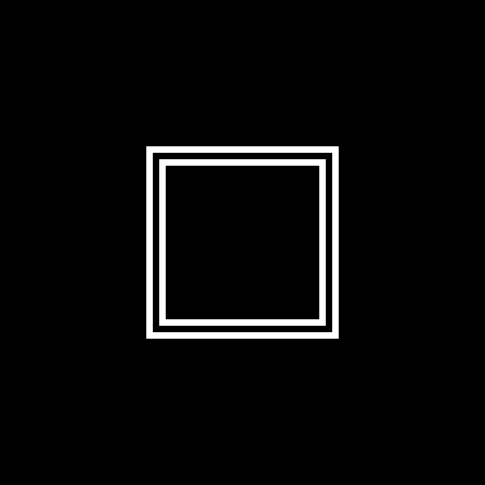

<Intro>
  The pmndrs assets, each one installed into your app from the registry with one command. The
  logo is the first.
</Intro>

## Logo

The pmndrs logo, in four states, as four SVG files. Install them with one command:

```sh
npx shadcn@latest add pmndrs/design-system/logo#v0.7.0
```

That writes them to `public/pmndrs/` at the root of your project, under the names below.

Every file is 600×600 and paints its own black square background: there is no transparent
variant yet.

### Variants

| Variant  | Preview                                                                                           | File                              | Behavior                                                                                        |
| -------- | ------------------------------------------------------------------------------------------------- | --------------------------------- | ----------------------------------------------------------------------------------------------- |
| Complete |                                   | `public/pmndrs/logo_complete.svg` | The full mark.                                                                                  |
| Idle     |        | `public/pmndrs/logo_idle.svg`     | The resting state: four concentric rings.                                                       |
| Animated |  | `public/pmndrs/logo_animated.svg` | Idle → complete, once, in 0.73 s. Under reduced motion, the complete mark shows without moving. |
| Loading  |               | `public/pmndrs/logo_loading.svg`  | Loops idle → each corner → idle, every 5.3 s. Under reduced motion, the mark only fades.        |

### Usage

Once installed (or copied into your app's `public/pmndrs/` by hand), each file is an image URL.
Both animations are CSS inside the SVG, so a plain `` plays them, and so does `next/image`
with `unoptimized`:

```tsx

```

## License

These assets are MIT-licensed, like the rest of the repository: see
[LICENSE](https://github.com/pmndrs/design-system/blob/main/LICENSE). No attribution required.
